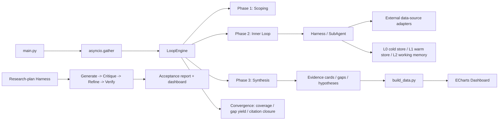

# Research Project Initiation System

一个面向生物信息学研究开题的 **AI Agent 系统工程框架**。它把“文献检索 → 论文深读 → 证据提取 → Gap 分析 → 假设生成 → 研究方案质量评测 → 可视化复盘”这条研究流程，抽象成一套可配置、可扩展、可评估的流水线。

> An engineering framework for AI-assisted research topic initiation. It organizes literature discovery, deep reading, evidence extraction, gap analysis, hypothesis generation, research-proposal evaluation, and visual retrospective analysis into a configurable and reproducible pipeline.


## 核心能力

- **配置化研究方向定义**：通过项目配置和 Archetype 抽象扩展新的研究方向，而不是把领域知识硬编码进主循环。
- **多技能研究流水线**：方向拆解、术语标准化、资源收集、多源检索、引文雪球、文献筛选、PDF 获取、深度阅读、证据卡提取、数据可及性分析、方法-数据匹配、Gap 分析和假设生成。
- **研究方案质量评测闭环**：生成 → 多角色评审 → 新颖性/红队复核 → 引用验证 → 修正 → 复验，并通过多维 Rubric 评分。
- **面向 LLM 幻觉的工程化防御**：证据账本、`SourceLocator`、质量门禁、引用三态验证、新颖性复核、best-plan 跨轮跟踪。
- **可复现知识底座**：Evidence Card、覆盖矩阵、Gap、Hypothesis、L0/L1/L2 三层上下文、Checkpoint、Token 预算、Response Cache、Provenance。
- **离线可视化 Dashboard**：ECharts 多 Tab 视图，可生成独立 HTML 离线打开。

## 系统流水线



## 快速开始

### 1. 环境要求

- Python >= 3.11
- Windows / Linux / macOS

### 2. 安装

```bash
git clone https://github.com/notifonly/Research-Project-Initiation-System.git
cd Research-Project-Initiation-System

pip install -e .

# 可选：开发依赖
pip install -e ".[dev]"
```

### 3. 配置

复制示例环境变量文件，并填入 LLM API 信息：

```bash
cp .env.example .env
```

```ini
AISCIENCE_LLM_MODEL=gpt-4o-mini
AISCIENCE_LLM_API_KEY=sk-your-api-key
AISCIENCE_LLM_BASE_URL=https://api.openai.com/v1
AISCIENCE_LLM_MAX_TOKENS=8192
```

### 4. 运行

```bash
# 运行所有已配置项目
python main.py

# 运行指定项目
python main.py --only <project_id>

# 开启断点调试
python main.py --breakpoints

# 重建仪表盘数据
python dashboard/build_data.py

# 运行测试
python -m pytest -q
```

## 项目结构

```text
Research-Project-Initiation-System/
├── main.py                    # 入口：并行运行器
├── shared/
│   ├── core/                  # LoopEngine、Orchestrator、LLM Client、Cache、Checkpoint
│   ├── skills/                # 通用研究流水线技能
│   ├── evidence/              # 证据卡 Schema、存储、覆盖矩阵
│   └── mcp/                   # 外部数据源适配器
├── archetypes/                # 研究范式抽象
├── projects/                  # 研究方向配置
├── scripts/                   # 辅助脚本与评测 Harness
├── dashboard/                 # ECharts 仪表盘与数据构建器
├── skills/                    # Agent prompt skill 文档
└── tests/                     # pytest 测试
```

## 文档

- [技能开发指南](docs/SKILL_DEVELOPMENT_GUIDE.md)
- [故障排查](docs/TROUBLESHOOTING.md)
- [计算机论文精读 Skill](skills/计算机论文精读skill.md)
- [概念解析 Skill](skills/概念解析v2.md)

## License

本项目基于 [MIT License](./LICENSE) 发布。

## 说明

这是个人科研辅助工具的工程化实现，重点展示如何用软件系统支撑研究选题、文献梳理、证据管理和方案评审。它当前不是面向任意用户的 SaaS，也不保证所有第三方数据源在长期内稳定可用；如果要在团队或生产环境中使用，建议补充 CI、评测集版本管理、更强的数据隔离和可观测性。
