# Research Project Initiation System

一个面向生物信息学研究开题（Research Topic Initiation）的 **AI Agent 系统**。它把“检索文献 → 深读论文 → 提取证据 → 发现 Gap → 生成假设 → 评测研究方案 → 可视化复盘”这条耗时数周的人工流程，抽象成一套可复现、可扩展、可评估的软件流水线。

> An AI-agent system for bioinformatics research topic initiation. It automates literature discovery, deep reading, evidence extraction, gap analysis, hypothesis generation, research-proposal quality evaluation, and visual retrospective analysis.


> 当前版本仍是研究原型：核心流水线已能端到端运行，但距离生产级平台还有工程化、部署与评测基础设施方面的打磨空间。

## Dashboard

以下截图来自离线 Dashboard，覆盖研究方向、技术路线/管线进度、文献证据、Gap、假设、方向分解、方案质量评测等关键视图。

| 概览 | 技术路线 / 管线分析 |
|---|---|
| 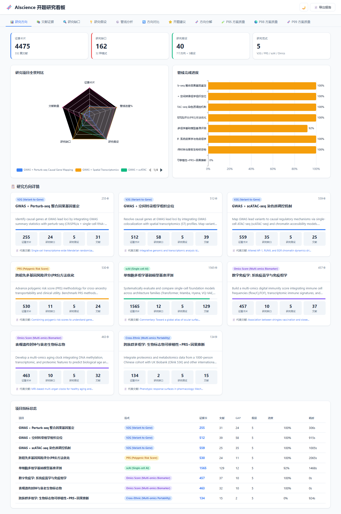 | 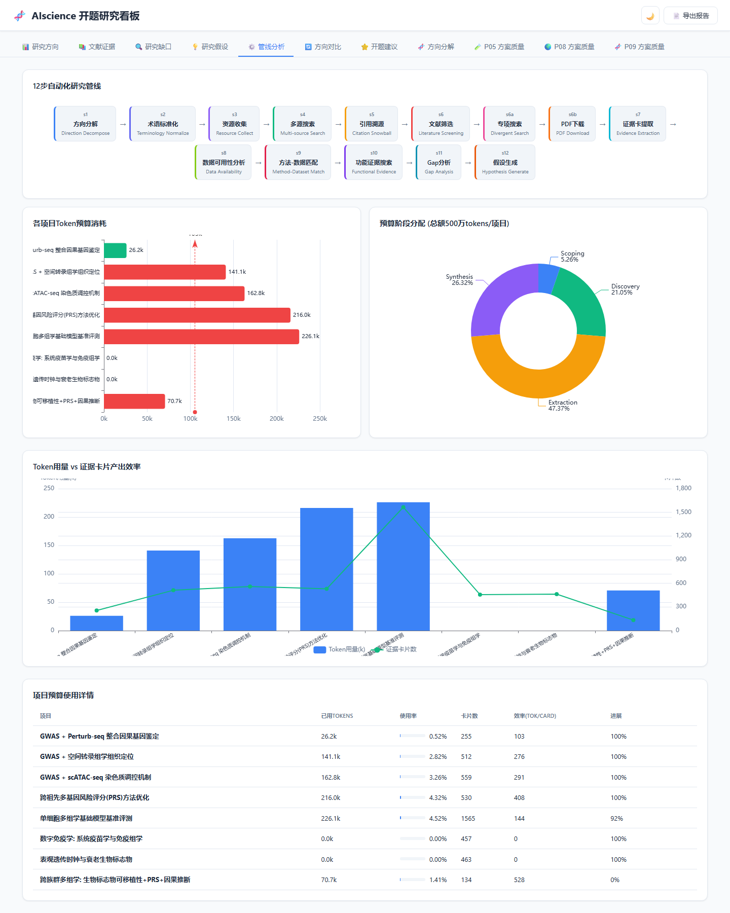 |

| 文献证据 | 研究缺口 |
|---|---|
| 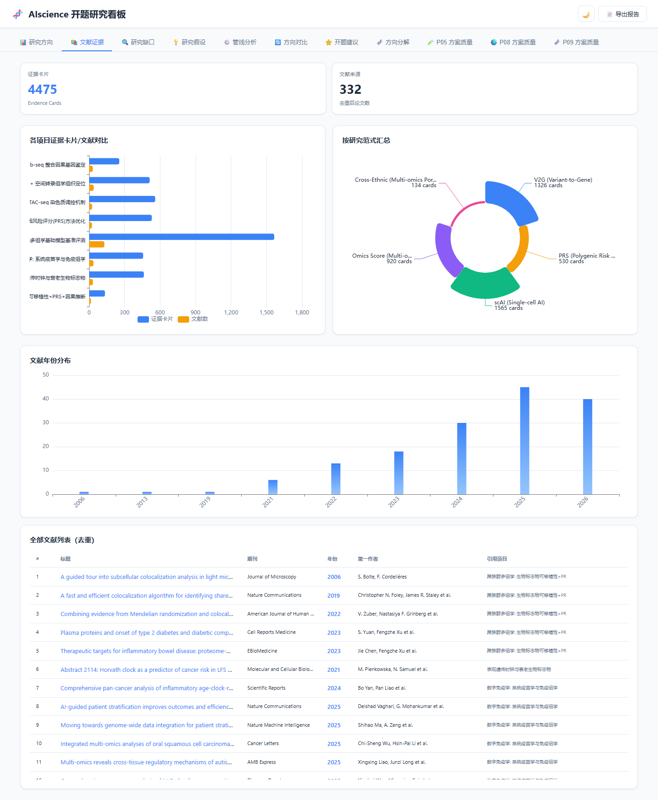 | 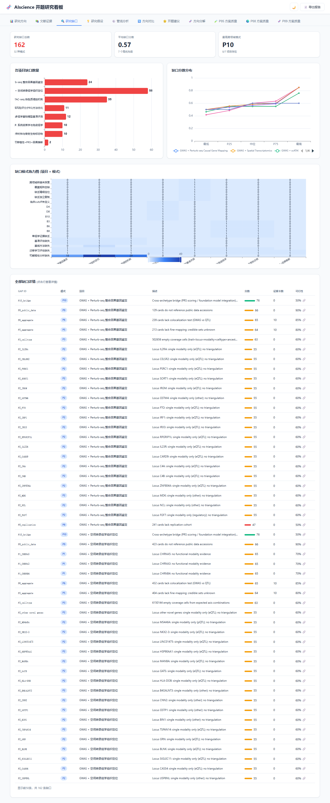 |

| 研究假设 | 开题建议 |
|---|---|
| 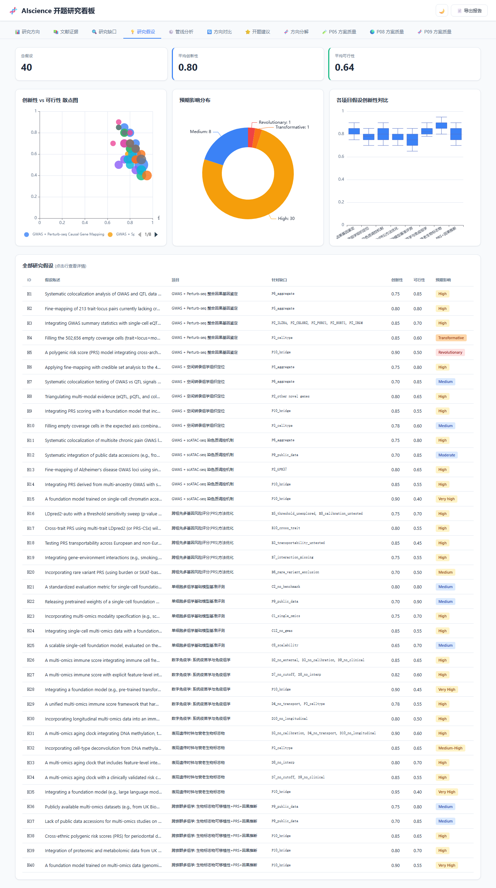 | 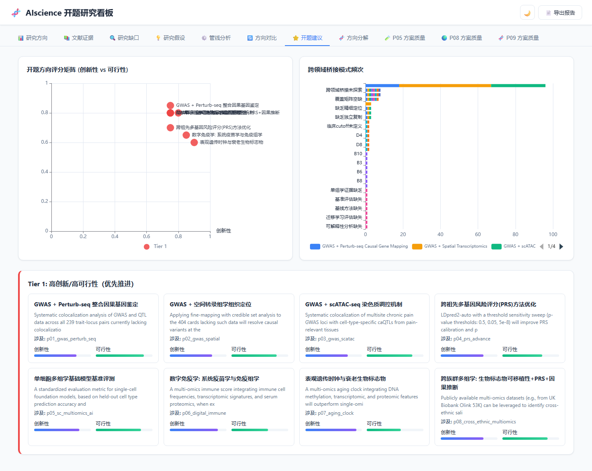 |

| 方向分解 | 方向对比 |
|---|---|
| 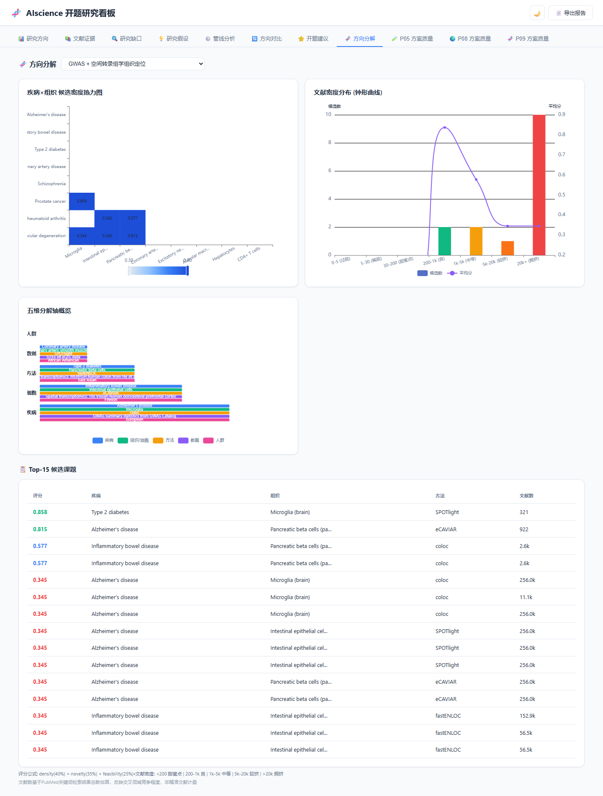 | 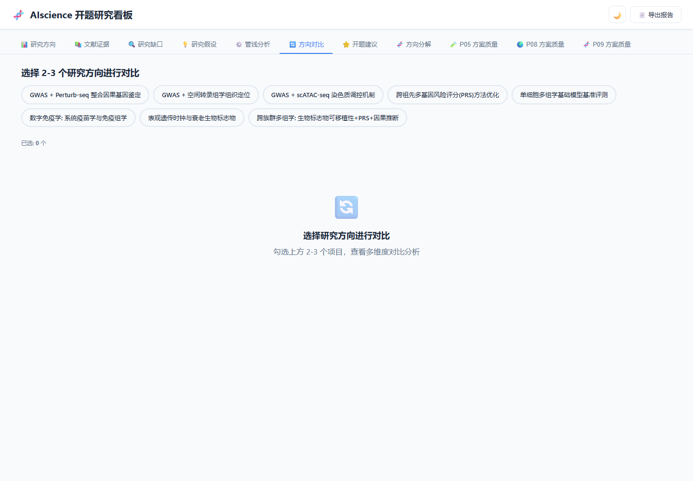 |

| P05 方案质量 | P08 方案质量 |
|---|---|
| 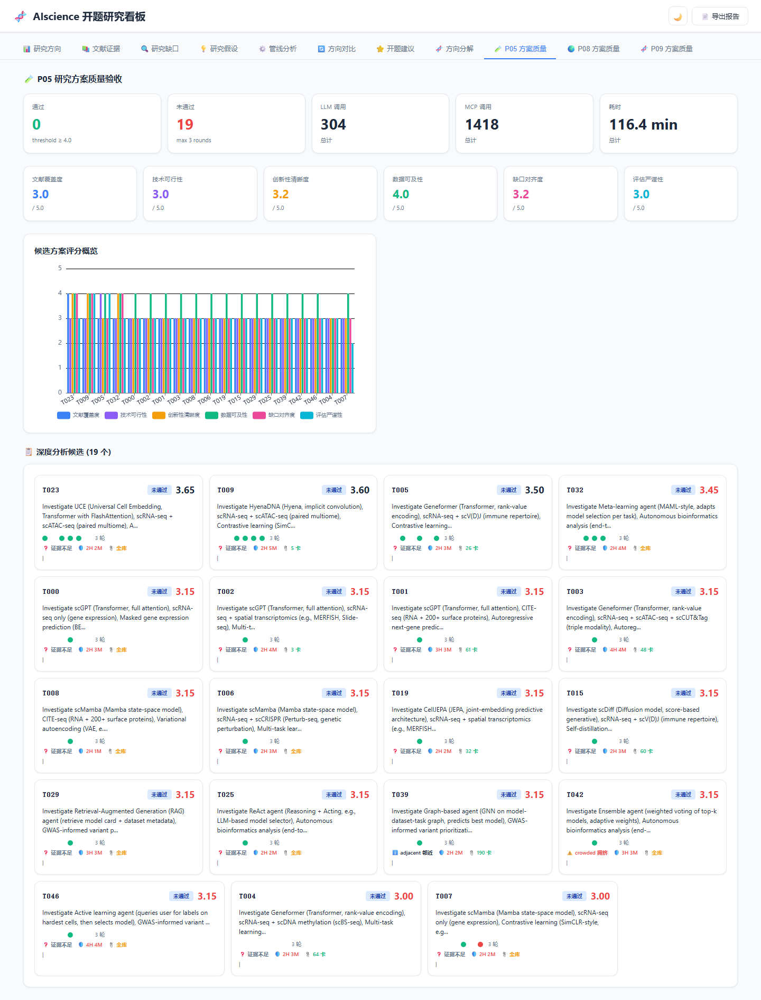 | 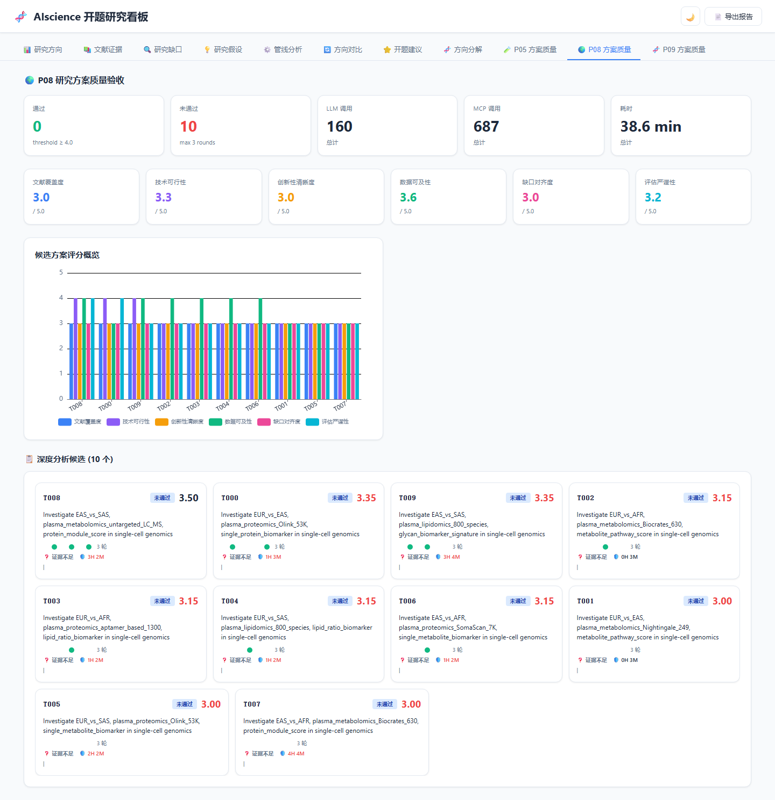 |

| P09 方案质量 | 暗色模式 |
|---|---|
| 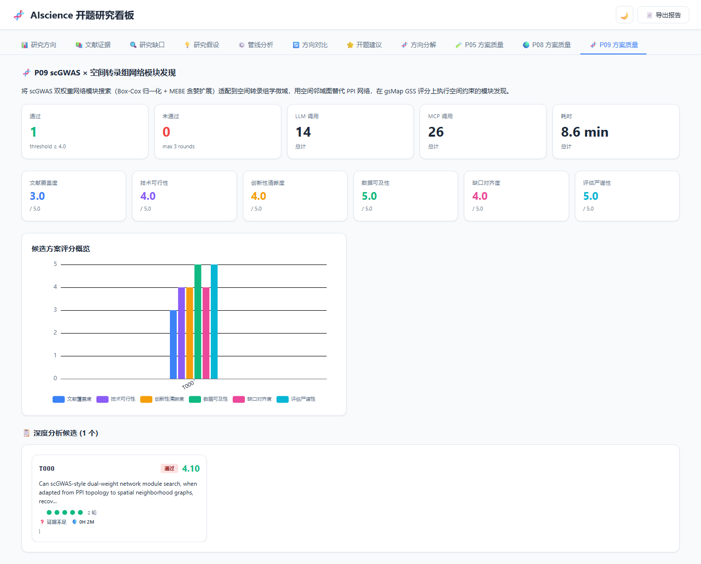 | 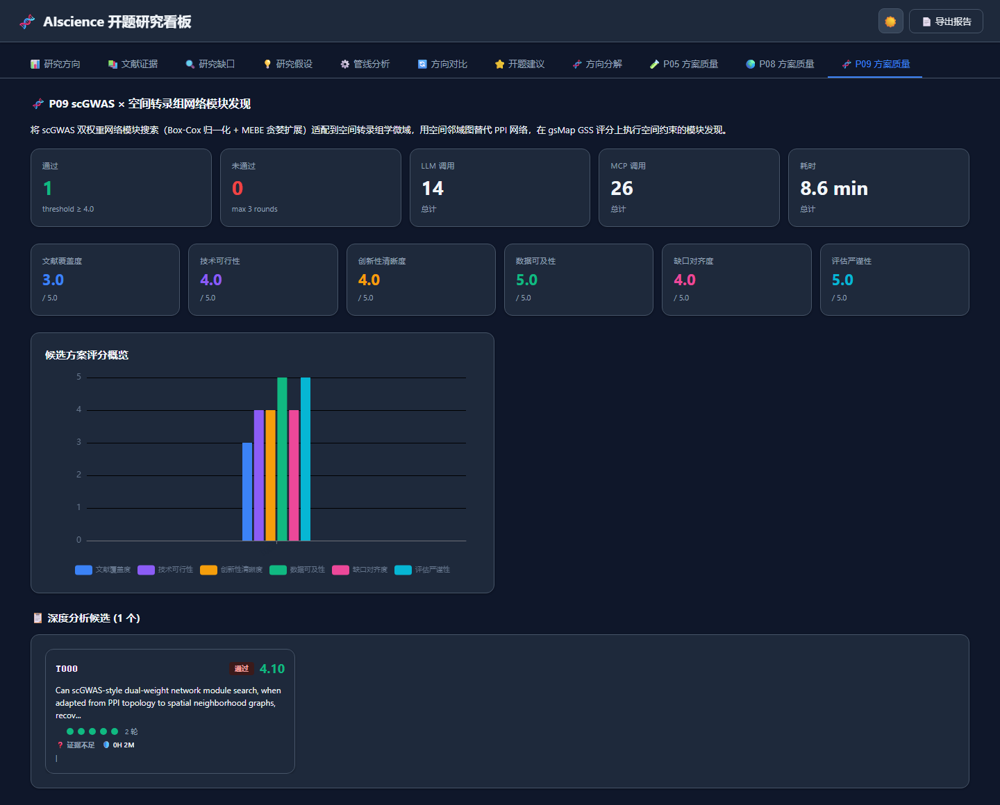 |

## P09 已通过方案案例

下面是一张完整案例长图，展示 P09 中最终通过的研究方案：从研究问题、迭代评分、技术路线、方法论红队评审、评审意见，到引用验证和证据锚定。

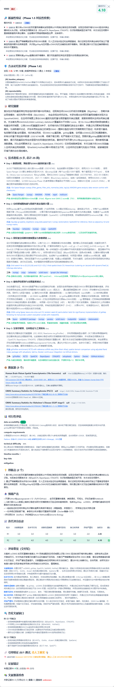

## 它能做什么

- **9 个研究子项目、6 种研究范式**：覆盖 GWAS 因果基因鉴定、跨祖先 PRS、单细胞多组学基础模型、数字免疫、衰老时钟、跨种族多组学、scGWAS × 空间转录组网络模块等方向。
- **12 技能主流水线**：方向拆解 → 术语标准化 → 资源/位点收集 → 多源检索 → 引文雪球 → 文献筛选 → PDF 获取 → 深度阅读 → 证据卡提取 → 数据可及性分析 → 方法-数据匹配 → Gap 分析 → 假设生成。
- **研究方案质量评测闭环**：P05/P08/P09 三套 Harness，覆盖“生成 → 多角色评审 → 新颖性/红队复核 → 引用验证 → 修正 → 复验”，使用 6 维 Rubric 对候选方案打分。
- **面向 LLM 幻觉的工程化防御**：证据账本、`SourceLocator`、质量门禁、引用三态验证、新颖性复核、best-plan 跨轮跟踪。
- **可复现知识底座**：Evidence Card、覆盖矩阵、Gap、Hypothesis、L0/L1/L2 三层上下文、Checkpoint、Token 预算、Response Cache、Provenance。
- **离线可视化仪表盘**：11 个 ECharts Tab，支持概览、证据、Gap、假设、管线进度、方案对比、方向分解，并可生成独立 HTML 离线打开。

## 系统流水线

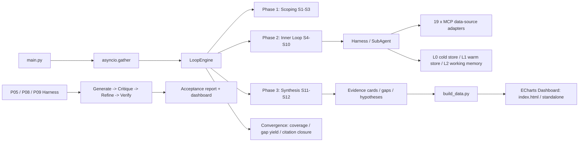

## 9 个研究方向

| Project | Research Direction | Archetype |
|---|---|---|
| `p01_gwas_perturb_seq` | GWAS + Perturb-seq 整合因果基因鉴定 | V2G |
| `p02_gwas_spatial` | GWAS + 空间转录组组织定位 | V2G |
| `p03_gwas_scatac` | GWAS + scATAC-seq 染色质调控机制 | V2G |
| `p04_prs_advance` | 跨祖先多基因风险评分（PRS）方法优化 | PRS |
| `p05_sc_multiomics_ai` | 单细胞多组学基础模型基准评测 | scAI |
| `p06_digital_immune` | 数字免疫学：系统疫苗学与免疫组学 | Omics Score |
| `p07_aging_clock` | 表观遗传时钟与衰老生物标志物 | Omics Score |
| `p08_cross_ethnic_multiomics` | 跨种族多组学整合、标志物可移植性与因果推断 | Cross-Ethnic |
| `p09_spatial_gwas_network` | scGWAS × 空间转录组网络模块发现 | Spatial GWAS |

## Demo Output

仓库内 `demo_output/` 提供一个小规模可复现示例，展示空间 GWAS 网络模块分析结果：

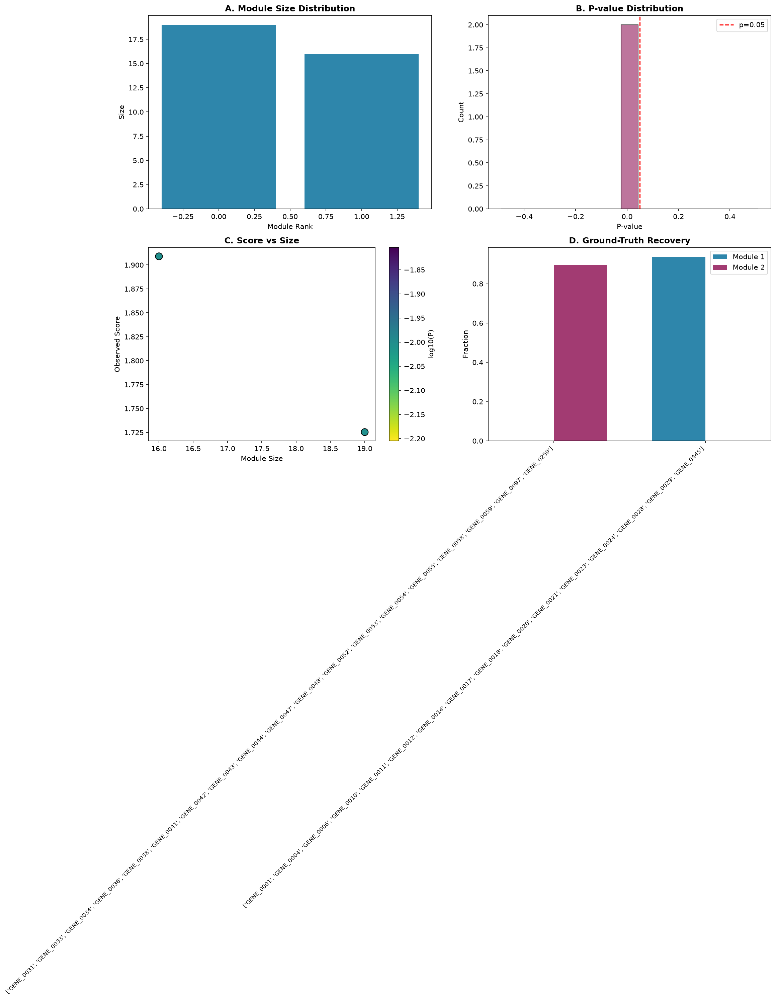

## 快速开始

### 1. 环境要求

- Python >= 3.11
- Windows / Linux / macOS

### 2. 安装

```bash
git clone https://github.com/notifonly/Research-Project-Initiation-System.git
cd Research-Project-Initiation-System

pip install -e .

# 可选：开发依赖
pip install -e ".[dev]"
```

### 3. 配置

复制示例环境变量文件，并填入 LLM API 信息：

```bash
cp .env.example .env
```

```ini
AISCIENCE_LLM_MODEL=gpt-4o-mini
AISCIENCE_LLM_API_KEY=sk-your-api-key
AISCIENCE_LLM_BASE_URL=https://api.openai.com/v1
AISCIENCE_LLM_MAX_TOKENS=8192
```

完整配置见 [docs/使用手册.md](docs/使用手册.md)。

### 4. 运行

```bash
# 运行全部 9 个项目
python main.py

# 只运行指定项目
python main.py --only p01_gwas_perturb_seq

# 运行多个项目
python main.py --only p01_gwas_perturb_seq,p04_prs_advance,p08_cross_ethnic_multiomics

# 开启断点调试
python main.py --breakpoints

# 重建仪表盘数据（含独立 HTML）
python dashboard/build_data.py

# 运行测试
python -m pytest -q
```

### 5. 研究方案质量评测

```bash
# P05：单细胞多组学基础模型
python scripts/p05_harness/main.py --max-candidates 10

# P08：跨种族多组学
python scripts/p08_harness/main.py --max-candidates 10

# P09：scGWAS × 空间转录组网络模块
python scripts/p09_harness/main.py --run-name run_v1
```

## 输出文件

| 输出 | 路径 | 说明 |
|---|---|---|
| 汇总报告 | `data/run_all_report.json` | 全部项目运行统计 |
| 跨领域扫描 | `data/cross_archetype_gap_scan.json` | 跨 Archetype 的桥接 Gap |
| 分项目报告 | `projects/{id}/output/final_report.json` | 单个项目 Gap、假设与统计 |
| 证据卡片 | `projects/{id}/output/evidence_cards.jsonl` | 结构化文献证据 |
| 覆盖矩阵 | `projects/{id}/output/coverage_map.json` | trait × locus × modality 覆盖矩阵 |
| 学习报告 | `data/learning_report.md` | 适合文献综述与方向比对 |
| P05/P08/P09 方案评测 | `data/{id}_harness_output/` | 候选方案评分与验收报告 |

## 项目结构

```text
Research-Project-Initiation-System/
├── main.py                    # 入口：并行运行器
├── shared/
│   ├── core/                  # LoopEngine、Orchestrator、LLM Client、Cache、Checkpoint
│   ├── skills/                # 12 个共享技能
│   ├── evidence/              # 证据卡 Schema、存储、覆盖矩阵
│   └── mcp/                   # 19 个外部数据源适配器
├── archetypes/                # 6 种研究范式
├── projects/                  # 9 个具体研究方向配置
├── scripts/                   # 辅助脚本与 P05/P08/P09 Harness
├── dashboard/                 # ECharts 仪表盘与数据构建器
├── docs/                      # 架构、使用、开发与复盘文档
├── demo_output/               # 离线示例输出与图片
└── tests/                     # pytest 测试
```

## 文档

- [使用手册](docs/使用手册.md)：完整使用指南
- [架构说明](docs/ARCHITECTURE.md)：系统架构与数据流
- [P05 流水线概览](docs/p05_pipeline_overview.md)
- [P05 方案质量评测](docs/p05_research_report_agent_benchmark.md)
- [P05 研究综述](docs/p05_research_survey.md)
- [技能开发指南](docs/SKILL_DEVELOPMENT_GUIDE.md)
- [故障排查](docs/TROUBLESHOOTING.md)
- [变更记录](docs/CHANGELOG.md)

## License

本项目基于 [MIT License](./LICENSE) 发布。

## 说明

这是个人科研辅助工具，主要目标是帮助自己完成计算生物学博士开题的文献梳理、方向筛选和方案评审。它目前不是面向任意用户的 SaaS，也不保证所有第三方数据源在长期内稳定可用；如果要在团队或生产环境中使用，建议补充 CI、评测集版本管理、更强的数据隔离和可观测性。
