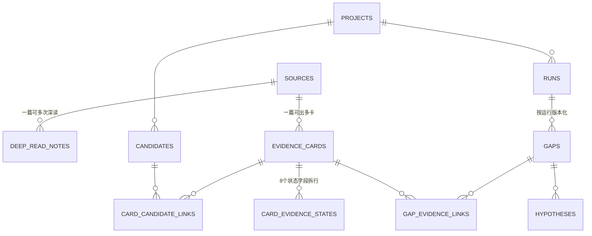

### **核心建议：按「全局知识层 + 项目研究层」两层设计——论文、深读笔记、证据卡作为跨项目可复用的知识资产；候选、缺口、假设作为项目专属的研究状态。技术选型上先用 SQLite（JSON1 + FTS5）起步，它和你现有的 ResponseCache 同栈，零运维成本，等出现多智能体并发写入或向量检索需求时再平滑迁移到 PostgreSQL。**

你现在的架构里其实已经有两个信号说明该做这件事了：一是证据卡目前存在 JSONL 里，用 `candidate:{topic_id}` 这种字符串标签做关联（架构文档 12.1 节自己都说这是个"标签基准"方案）；二是 S6C 深读是管线里最贵的环节（LLM 调用密集、受 token 预算约束），但深读笔记目前只服务于当次运行。数据库化的最大收益不是"管理"，而是**把昂贵的 LLM 产出物变成可跨方向复用的资产**。

### **第一层设计原则：分清「知识资产」和「研究状态」**

看你的架构，数据天然分成两类，这是整个设计的分水岭：

**知识资产（方向无关，永久沉淀）**：论文/数据库/代码仓等来源、深读笔记（facts/claims/judgments）、证据卡。它们的共同点是——一旦产出，换一个研究方向依然有效。比如 scGPT 那篇论文的深读笔记，未来做 P06 或其他组学方向时照样能用。

**研究状态（项目专属，按 run 版本化）**：候选（candidates）、缺口（IdentifiedGap）、假设（Hypothesis）、harness 评估结果。这些是同一份证据在不同研究问题下的"解读"，换方向就要重新生成。

关键洞察来自你自己的 S7 双路径设计：**深读是 archetype 无关的，卡片提取才是 archetype 特定的**。所以库里应该把 `deep_read_notes` 挂在论文上（一篇论文一份笔记，全局唯一），而 `evidence_cards` 挂在「论文 × archetype」上（同一篇论文可以被不同方向提取出不同 schema 的卡）。这样新方向来了，S6C 直接跳过已有笔记的论文，只跑 S7 重新提取——省掉的就是最贵的 LLM 调用，按你 45% 的提取预算占比，这是实实在在的 token 节省。

### **库表设计**



**全局知识层**（三张核心表）：

| 表 | 作用 | 关键字段 |
|---|---|---|
| `sources` | 统一存所有来源（你的 SourceType 枚举：paper/database/preprint/code_repo/dataset） | source_id, source_type, doi, pmid, title, title_norm, authors(JSON), year, venue, url, pdf_path, raw_meta(JSON) |
| `deep_read_notes` | S6C 产出，一论文一份（最新版有效，历史按 run_id 留痕） | note_id, source_id(FK), run_id, facts(JSON), claims(JSON), judgments(JSON), tier |
| `evidence_cards` | S7 产出，按 archetype 区分 schema | card_id, source_id(FK), archetype, key_finding, method_brief, limitation_*, reliability_flag, payload(JSON), schema_version, extract_run_id |

**项目研究层**（把现在的隐式关联全部显式化）：

| 表 | 对应你现有的什么 | 设计要点 |
|---|---|---|
| `projects` | P05 这个项目本身 | project_id, archetype_id, config(JSON)，新方向就是插一行 |
| `candidates` | decompose_pilot_results.json 的候选 | candidate_id, project_id(FK), research_question, axis_values(JSON) ← 你的 scfm_depth × agent_line 分解轴值 |
| `card_candidate_links` | **替代 `candidate:{id}` 标签 hack** | card_id + candidate_id + relation（直接用 CandidateEvidenceLink 的 supports/contradicts/adjacent/prior_work/dataset/method）+ relevance_score + link_method |
| `runs` | 每次管线运行的溯源 | run_id, project_id, skill_step, config_hash, token_used, started_at |
| `gaps` / `gap_evidence_links` | IdentifiedGap + GapEvidenceLink | gap 按 run_id 版本化（同批卡片不同 run 允许出不同缺口）；evidence_links 的 matched_field/matched_rule/weight/rationale 四元组原样落表 |
| `hypotheses` | Hypothesis | gap_id 外键关联，novelty_score/feasibility_score 建列便于排序 |

三个具体决策值得展开：

**第一，archetype 专属的 48 个字段放 JSON payload，不建宽列。** 你现在有四个原型（V2G/PRS/SC_FM/OMICS_SCORE），未来还会加，每个都 35\~48 个字段，建宽表会无限膨胀。SQLite 的 JSON1 扩展支持 `json_extract(payload, '$.task')` 直接查询和建索引，够用。核心分类字段（archetype、source_id、reliability_flag）提成真实列，因为它们是所有查询的公共入口。同时给 cards 加 `schema_version` 列——v2 你把 EvidenceState 从 3 值扩到 6 值，以后类似变更靠这列做向后兼容。

**第二，8 个 EvidenceState 字段拆成子表 `card_evidence_states`**（card_id, field_name, state）。这样 S11 缺口分析从 Python 遍历变成一条 SQL：

```sql
SELECT field_name, state, COUNT(*) 
FROM card_evidence_states cs
JOIN evidence_cards c USING (card_id)
WHERE c.archetype = 'sc_fm' AND state IN ('reported_not_done', 'not_reported')
GROUP BY field_name, state;
```

你 v2 的加权缺口评分（1.0 vs 0.55）就是在这个结果上加权聚合，C3/C5/C6/C9 那类 EvidenceState 感知缺口的计算会干净很多。

**第三，去重是入库的第一道闸。** 对 `doi`（小写规范化）建唯一索引；无 DOI 的用 `title_norm + year`（标题转小写、去标点）兜底。S4/S5 每次搜回来的论文先过这层查重，命中已有论文就直接复用，不重复下载、不重复深读。

### **多方向扩展：archetype × project 是唯一扩展轴**

你担心"后续有不同方向怎么办"，其实你的架构已经把答案写好了——方向 = 一个新 archetype（卡片 schema + 缺口模式 + 覆盖轴）+ 一个新 project（分解轴 + 收敛规则）。数据库只要让这两个维度各自独立：

- **新方向复用旧 schema**（比如再来一个单细胞相关的 P08）：插一行 project，指向已有的 `sc_fm` archetype，卡片库即查即用。
- **新方向需要新 schema**：新建 archetype 卡片类（对应库里 payload 的新 JSON 结构 + 新 schema_version），老卡片不受影响。
- **跨方向红利**：同一篇论文被多个方向各自提取卡片后，你可以跑跨 archetype 的缺口分析——比如"held-out 评估缺失在 sc_fm 和 prs 两个领域同时成立"，这种元层面的缺口是你现在单项目 JSONL 模式根本算不出来的。

### **技术选型与演进路径**

第一阶段就用 SQLite，理由很实际：你已经在 `shared/core/cache.py` 用 SQLite 了，运维经验现成；单用户研究项目没有并发写压力（开 WAL 模式即可支持读写并发）；JSON1 处理 payload、FTS5 给 key_finding/abstract 建全文索引，覆盖你当前所有查询需求。建库脚本一次到位：

```sql
PRAGMA journal_mode = WAL;
CREATE VIRTUAL TABLE sources_fts USING fts5(title, abstract, content='sources', content_rowid='rowid');
CREATE VIRTUAL TABLE cards_fts USING fts5(key_finding, method_brief);
```

升级触发点有两个：一是多个 Agent 并行跑不同项目、写入冲突变多，迁 PostgreSQL + JSONB；二是想做语义检索（你的 CandidateEvidenceLink 里预留了 `link_method="semantic_retrieval"`，说明已经在路线图上了），那时加 pgvector 或 sqlite-vec，给卡片 embedding 建表，记得存 embedding 模型名和维度，方便换模型时重建。

### **与现有管线的集成：DB 是写侧真相，JSONL 降级为导出视图**

有一点必须保留：你刻意设计的"管线与评估框架通过文件系统解耦"是好架构，不要因为上库而破坏它。正确姿势是——

管线各技能改为写数据库（S6C 写 notes、S7 写 cards、S11/S12 写 gaps/hypotheses），然后加一个**确定性导出器**：从 DB 生成 `evidence_cards.jsonl` 和 `final_report.json` 快照，harness 继续读文件、代码零改动。这样 DB 成为唯一的写入入口和查询入口，文件退化为可重建的派生物，解耦关系原封不动。

落地顺序建议分四步：先写建库 schema 和 JSONL 回填脚本（把现有产出物导入，立刻可用）；再改造 S6C/S7 的写入路径；然后做导出器保证 harness 兼容；最后把 S11 缺口分析换成 SQL 驱动的加权计算。另外注意**不要**把 LLM 原始请求/响应、PDF 二进制塞进这个库——前者留给现有 ResponseCache（易失、可清空），后者在文件系统存路径引用即可。这个库的定位是"策展过的知识层"，不是日志坟场。

这样设计下来，P05 跑几轮之后你手里攒的就不只是几份 final_report，而是一个跨方向可复用、可全文检索、缺口信号可重算的单细胞文献知识库——后续每个新方向的边际调研成本会越来越低，这才是基础模型领域做长期研究最值钱的资产。

*内容由 AI 生成仅供参考*