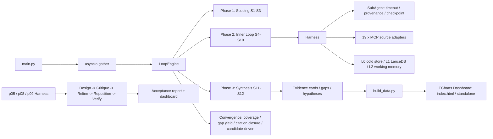

# AIscience：AI Agent × 生物信息学研究开题系统

> **项目能力证明（求职版）**
>
> 一句话：我独立设计与实现了一个面向生物信息学研究选题的 **AI Agent 系统**，覆盖多源文献检索、论文自动深读、证据卡提取、研究 Gap 分析、研究假设生成、研究方案质量评测和可视化仪表盘，并用真实数据完成了 8 个研究方向的端到端运行。
>
> 适用岗位：AI/LLM Agent 工程师、机器学习平台工程师、数据/后端工程师、AI for Science 研究员、生物信息学工程师、研发负责人。

## 1. 项目概览

AIscience 解决的问题是：计算生物学博士开题、领域调研或研究方案评估时，人工阅读文献、整理证据、识别研究缺口、形成假设、再判断一个方向是否值得做，通常需要数周甚至数月。这个项目把这一过程抽象成一个可复现、可扩展、可评估的软件系统。

系统核心不是“一个会聊天的 Agent”，而是一套包含以下能力的工程平台：

- **9 个研究子项目、6 种研究范式**：GWAS 因果基因鉴定、PRS 跨祖先优化、单细胞多组学基础模型评测、数字免疫评分、衰老时钟、跨种族多组学整合、scGWAS × 空间转录组网络模块发现等。
- **12 个主技能流水线**：方向拆解 → 术语标准化 → 资源/位点收集 → 多源检索 → 引文雪球 → 文献筛选 → PDF/深读 → 证据卡提取 → 数据可及性 → 方法-数据匹配 → Gap 分析 → 假设生成；项目可按需插入 S6A/S6B/S6C 变体。
- **3 套研究方案质量评测框架**：P05（单细胞基础模型）、P08（跨种族多组学）、P09（空间 GWAS 网络模块），实现“生成 → 多角色评审 → 新颖性/红队复核 → 引用验证 → 修正 → 复验”的闭环。
- **可复现的知识底座**：证据卡、覆盖矩阵、Gap、假设、L0/L1/L2 三层上下文、检查点、Token 预算、调用缓存、溯源报告。
- **可视化仪表盘**：11 个 ECharts Tab，支持概览、文献证据、Gap、假设、管线进度、方案质量对比和方向分解。

## 2. 可以用什么岗位能力来证明

| 岗位要求 | 项目中的直接证据 |
|---|---|
| AI Agent / LLM 应用开发 | litellm 统一模型适配、JSON 响应容错解析、超时/重试/错误分类、Token 分阶段预算、SQLite ResponseCache；Skill 抽象 + Harness 调度 + 子代理故障隔离 |
| 机器学习/研究平台 | 研究方向用配置而非硬编码扩展：`archetype/{id}/config.yaml` 决定证据卡、Gap 模式、覆盖轴、收敛策略；新增 P08/P09 时无需重写主循环 |
| 数据工程/后端 | 19 个外部数据源适配器、异步并发控制、LanceDB 证据卡存储（JSONL 降级）、JSONL/JSON 结构化产出、SQLite 缓存、Schema 校验 |
| 生物信息/统计遗传学 | 6 个 Archetype、62 个领域 Gap 模式、V2G/PRS/scFM/Omics Score/跨种族/空间 GWAS 领域术语与枚举；覆盖矩阵、共定位、外部验证、公共数据可及性等维度的自动检测 |
| 评测/质量保障 | P05/P08/P09 Critique-Refine Harness、6 维评分 Rubric、多角色评审、引用验证（3 态）、红队复核、新颖性复核、质量门禁、best-plan 跨轮跟踪 |
| 前端/可视化 | ECharts 分组柱状图/雷达图/热力图/散点图、11 个 Tab、暗色模式、移动端断点、表格横向滚动与固定表头、独立静态 HTML 版本 |
| 文档与协作 | README、使用手册、架构文档、Changelog、Session 记录、Troubleshooting、技能开发指南；每轮关键问题都有可追溯的修复记录 |

## 3. 可验证的成果快照

以下数字均来自仓库内真实输出文件，统计截至 `2026-07-26` 的管线产出，测试结果为 `2026-08-22` 本地执行。

### 3.1 管线产出（p01–p08 已完整运行）

| 项目 | 研究方向 | 证据卡 | Gap | 假设 | 运行耗时 |
|---|---|---:|---:|---:|---:|
| p01 | GWAS + Perturb-seq 因果基因鉴定 | 255 | 24 | 5 | 306s |
| p02 | GWAS + 空间转录组组织定位 | 512 | 58 | 5 | 915s |
| p03 | GWAS + scATAC-seq 调控机制 | 559 | 35 | 5 | 1005s |
| p04 | 跨祖先 PRS 方法优化 | 530 | 11 | 5 | 2065s |
| p05 | 单细胞多组学基础模型评测 | 1565 | 12 | 5 | 1468s |
| p06 | 数字免疫表型评分 | 457 | 10 | 5 | 3087s |
| p07 | 多组学衰老时钟 | 463 | 10 | 5 | 1352s |
| p08 | 跨种族多组学整合 | 134 | 2 | 5 | 924s |
| **合计** | | **4475** | **162** | **40** | |

> p09 目前以研究方案评测框架和独立原型工程形式推进，AIscience 仓库内保留配置、Archetype、Harness 与运行结果；完整管线输出不在本仓库的 `projects/p09.../output/` 中。

### 3.2 研究方案质量评测

| Harness | 候选数 | 达到 4.0 阈值 | 说明 |
|---|---:|---:|---|
| P05 | 11 | 2 | 合并多个运行，含 scFM 与 Agent 两类候选 |
| P08 | 10 | 0 | 首轮全部未过阈值，说明阈值/标准确实可筛选方案 |
| P09 | 1 | 1 | 最低-最高维度得分 3.0–5.0 |

这里的“未通过”不是失败，而是评测系统有价值的证据：它能阻止未经充分证据支撑的研究方案进入执行阶段，并能暴露“文献覆盖不足”“评估严谨性不足”等具体问题。

### 3.3 工程质量

- **测试：179 个 pytest 用例，本地全部通过**（`python -m pytest -q`）。
- **数据源：19 个注册 MCP 适配器**，覆盖 PubMed、Semantic Scholar、Europe PMC、Crossref、bioRxiv/arXiv、OpenReview、GWAS Catalog、Open Targets、GEO、Ensembl、ENCODE、CellxGene、scPerturb、GitHub、PapersWithCode、HuggingFace、CORE 等。
- **领域模式：6 个 Archetype，62 个 Gap 模式标识**，其中 scFM 含 C1–C12，包含架构同质化、评估指标缺失、GWAS 交叉任务等专有模式。
- **可视化：11 个 Tab + 共享 ECharts 封装 + 独立 HTML**，可直接离线打开。
- **文档：`docs/` 下 24 篇 Markdown**（另有 README 和项目级 README/AGENTS），包括系统架构、使用手册、Changelog、P05 深读/评测/修复 Session 记录、故障排查和技能开发指南。

## 4. 系统架构



关键设计决策：

1. **领域抽象放在“Archetype + 配置”**，而不是写死在主循环里。这样每新增一个研究方向，只需新增卡片 Schema、Gap 模式和项目配置。
2. **三层上下文**：L0 冷存储保存完整快照与子代理输出；L1 用 LanceDB 保存证据卡；L2 保存当前运行的工作记忆。既支持断点续跑，又能做卡片级溯源。
3. **收敛不是“跑满轮数”**：内层用查询枯竭/引文闭合/反思确认，外层用覆盖矩阵 Jaccard、Gap 产出率、引文网络闭合；P08/P09 还支持候选驱动的有界探索。
4. **LLM 输出必须经过质量门禁**：S6C 深读只记录带 SourceLocator 的事实、声明和判断；S7 提取前有填充率、证据率、相关性过滤；Harness 对研究方案做引用验证和红队复审，避免“看起来像论文”的幻觉内容。
5. **先建立评测，再信任生成**：P05/P08/P09 的 Rubric 不是主观打分，而是多角色评审、新颖性检查、红队复核、修正后复验的完整闭环。

## 5. 代表性工程亮点

### 5.1 从“能跑”到“能续跑、可追责”

- `CheckpointManager` 支持按轮、按技能、按候选保存进度，失败可恢复。
- `SubAgent` 对每个技能做超时、异常分类和 scratch 持久化，单个技能失败不会拖垮整个项目。
- `ProvenancePipeline` 为新增证据卡生成溯源报告。
- `TokenBudget` 把 500 万 Token 按 Scoping / Discovery / Extraction / Synthesis 分阶段分配，避免单一阶段烧光预算。

### 5.2 对“LLM 幻觉”做了工程化防御

- `DeepReadNote` 强制区分事实、作者声明、判断、公式、实验，并把每一条信息关联到 `SourceLocator`（章节/页码/图表/公式）。
- 程序化质量门禁检查“声明是否有证据”“强判断是否有直接证据”“引用是否可验证”。
- Harness 的引用验证返回 `verified / not_found / unverifiable` 三态，不会因为查不到就静默丢弃。
- 新颖性验证对每个创新点做多源检索，支持 `scooped / crowded / adjacent / clear` 判定，并在修正后复验。
- P05 还实现了 best-plan 跨轮跟踪，避免最终输出被“最后一轮”覆盖。

### 5.3 从单一项目到可复用平台

P05 先完成单细胞基础模型的 Harness，随后把 `DomainPrompts`、Rubric、LoopRunner、报告生成等核心泛化为共享组件，再快速复用到 P08 和 P09。P08 只增加领域 prompt 和卡片分类字段，P09 只增加领域 prompt 和单个种子候选，说明架构的可扩展性是经过实际验证的。

### 5.4 数据与可视化闭环

`build_data.py` 会读取 9 个项目输出、Harness 结果和方向分解结果，生成 `data.json`；`index_standalone.html` 可以直接打开用于展示。每个 Tab 都遵循统一的图表规则（多系列滚动图例、语义独立维度不用堆叠、移动端断点、表格滚动等），说明我不仅会写功能，也会维护前端的一致性和可访问性。

## 6. 代码地图（面试时可直接打开）

| 你想证明什么 | 看哪里 |
|---|---|
| 三层循环与收敛 | [shared/core/loop_engine.py](../shared/core/loop_engine.py) |
| 上下文与冷/温存储 | [shared/core/context.py](../shared/core/context.py) |
| 技能执行隔离 | [shared/core/harness.py](../shared/core/harness.py) |
| LLM 调用与缓存 | [shared/core/llm_client.py](../shared/core/llm_client.py)、[shared/core/cache.py](../shared/core/cache.py) |
| 证据卡 Schema | [shared/evidence/base_card.py](../shared/evidence/base_card.py) |
| S6C 深读证据账本 | [shared/skills/deep_read/schemas.py](../shared/skills/deep_read/schemas.py) |
| 质量门禁 | [shared/skills/deep_read/quality_gates.py](../shared/skills/deep_read/quality_gates.py) |
| Gap 模式 | [shared/skills/skill_11_gap_analysis.py](../shared/skills/skill_11_gap_analysis.py)、[archetypes/*/gap_patterns.py](../archetypes/) |
| P05 Harness | [scripts/p05_harness/](../scripts/p05_harness/) |
| 可视化构建 | [dashboard/build_data.py](../dashboard/build_data.py)、[dashboard/js/tabs/](../dashboard/js/tabs/) |
| 完整变更脉络 | [CHANGELOG.md](./CHANGELOG.md) |

## 7. 常见问题速答与面试讲法

### 7.1 这个项目最大的难点是什么？

不是“让模型搜索文献”，而是让 9 个不同领域的研究方向共享一套引擎，同时保证结果可复现、可追责、可评估。我在开发过程中实际遇到了覆盖矩阵未填充导致收敛失效、证据卡去重失败、LLM 生成不存在的引用、Rubric 惩罚真正创新方向等问题；这些都不是靠提示词能解决的，最终靠架构和数据模型修正。

### 7.2 为什么值得做三套 Harness？

因为“研究方案好不好”不能靠生成结果自我评价。P05/P08/P09 的 Harness 把方案质量拆成 6 个维度，用多角色评审、新颖性复核、红队复核和引用验证形成闭环。P05 合并运行时 11 个候选只有 2 个通过，说明这套标准确实在筛选，而不是走过场。

### 7.3 如果让我做生产级平台，下一步是什么？

1. 把知识资产（论文、深读笔记、证据卡）和项目状态（候选、Gap、假设）分库，跨方向复用昂贵的深读结果。
2. 用 PostgreSQL/真正的向量检索替代 JSONL 标签关联，并支持多智能体并发写。
3. 增加模型/提示词/A/B 实验的版本管理与回滚。
4. 把 Harness 的通过/失败变成持续集成门禁，接入 CI 跑回归测试与评测集。

## 8. 如何使用这份材料

### 8.1 面试自我介绍（约 30 秒）

“我独立设计了一个面向生物信息学研究选题的 AI Agent 系统：9 个研究子项目共享一套 12 技能流水线，覆盖 19 个外部数据源；系统能自动形成证据卡、Gap 和假设，并额外开发了三套研究方案质量评测框架。目前已用真实数据产出 4475 张证据卡、162 个缺口和 40 条假设，179 个测试全部通过。其中我最看重的是对 LLM 幻觉的防御：从证据账本、质量门禁到引用验证、红队复核，形成了一条完整的可靠性链路。”

### 8.2 运行示例

```bash
# 单方向运行（需要 .env 中配置 LLM API）
python main.py --only p05_sc_multiomics_ai

# P05 研究方案质量评测
python scripts/p05_harness/main.py --max-candidates 10

# P08 研究方案质量评测
python scripts/p08_harness/main.py --max-candidates 10

# P09 研究方案质量评测
python scripts/p09_harness/main.py --run-name run_v1

# 重建仪表盘数据
python dashboard/build_data.py

# 跑测试
python -m pytest -q
```

### 8.3 相关工程文档

- [项目 README](../README.md)
- [系统架构](./ARCHITECTURE.md)
- [使用手册](./使用手册.md)
- [变更记录](./CHANGELOG.md)
- [P05 深读设计](./session_2026-07-21_p05_s6c_deep_read.md)
- [P05 研究方案质量评测](./p05_research_report_agent_benchmark.md)

---

本文件中的所有数字均可在仓库内复核；若有关键数字因重新运行而变化，请以最新 `projects/*/output`、`data/*_harness_output` 和 `python -m pytest -q` 结果为准。
